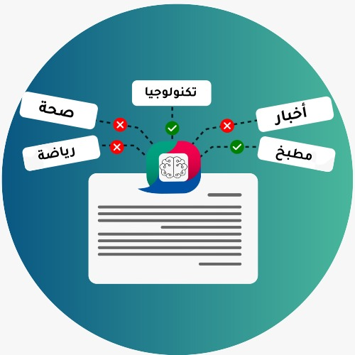

# Mowjaz Multi-Topic Labelling Task

<p align="center"> <br />

This repo contains the code required to reproduce the baselines for the Mowjaz Multi-Topic Labelling Task. To access the page of the competition on the Jordan University of Science and Technology website you can use this [link](https://www.just.edu.jo/icics/icics2021/com/Task%20Description.html). Here you can find general information about the competition. For participating you need to access the competition website as hosted on codalab, via this [link](https://competitions.codalab.org/competitions/29220). Here you can make submissions to the competition and view the leaderboard.

## Reproducing the Baselines
To reproduce the baselines, you need first to clone this repo to your machine. In the root directory of your clone of the repo, and in order to install the required packages you need to run the following commands (this assumes that you are working on a modern linux distro that has python3):
```bash
python3 -m venv env
source env/bin/activate
pip install -r requirements.txt
```
Once done, you need to run the `bash aravec.sh` to download the required Aravec embedding files. This will install a large zip file and extract it to the required location. This could take a while depending on the speed of your internet connection.

### Running the Baseline Notebooks
Once the above steps have been accomplished successfully, you need to switch into the `notebooks` directory using `cd notebooks` on your shell. Next you need to run the command `jupyter notebook`  which would start a new tap on your browser. If you wish to reproduce the deep learning based baseline then you need to run the `Deep_Learning_Baseline.ipynb` notebook and run each step. Once done, a file named `answer.tsv` can be found under `/Data/outputs`.

For running the SVC baseline, you need to run the `SVC_baseline.ipynb` and follow the same steps. An identical file to the one produced from the step before will be found in the same directory.

Please ensure that you zip your submission before uploading it to the competition page on codalab. This can be done on a unix/linux system as follows:

```
zip submission.zip answer.tsv
```

## API
This repo comes with an API wrapper developed for educational purposes. This requires that you have both models saved in their right directories (this will be achieved anyway if you have run both notebooks from the section above successfully. To start the API, you need to run `start_microservice`, then in a separate tap you can query either model via their respective route (i.e for the classical model, you can use `/classify` whereas for the deep learning one you can use `/dl_classify`. Below is an example of a `POST` request and its response using the `/classify` route:

### Request
```
curl --request POST http://localhost:5000/classify --header "Content-Type: application/json" --data '{"text":"فيروس كورونا: البنك الدولي يهدد بتعليق تمويل برنامج التلقيح في لبنان"}'
```
### Response
```
{
  "results": [
    0, 
    0, 
    0, 
    1, 
    0, 
    0, 
    0, 
    0, 
    0, 
    0
  ], 
  "status": "success"
}
```
The response above returns a 10 dimensional vector that represents the same order of topics in the training and validation data. In this case, the fourth dimension, for which there is a prediction, represents the `economy` category.

## Docker
We are also providing a dockerfile that can be used to build a docker image from which the API can be served. We are also providing this for educational purposes. This also requires that the models be created and saved in their respective directory, which again will be achieved if you managed to run each of the notebooks successfully.

To build the docker image, you need to run the following command in the root directory of the current repo:
```
docker build . -t mowjaz:latest
```
Once the image is built successfully, you can run a container that serves the api as follows:
```
docker run -p 5000:5000 -d mowjaz:latest
```
You can then query the api as shown in the API section above. Once done, don't forget to stop the container.
